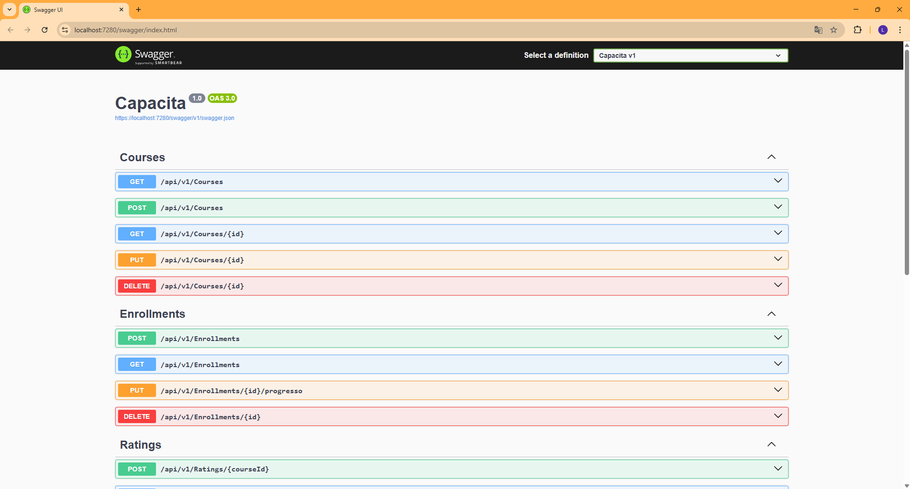
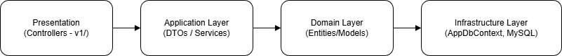

# 📚 Capacita - Sistema de Capacitação Contínua

API RESTful desenvolvida com ASP.NET Core Web API para gerenciar cursos, usuários, matrículas, progresso e avaliações no contexto de capacitação profissional contínua.

## 👨‍💻 Integrantes

### Lucas Speranzini - RM98297
### João Paulo de Souza - RM99805

## 🔧 Tecnologias utilizadas

.NET 8
ASP.NET Core Web API
Entity Framework Core
Migrations
Swagger
Banco de Dados MySQL

## 🧪 Execução

Instale as dependências:

## 1. Configure a connection string em appsettings.json com suas credenciais do MySQL (usuário e senha)

## 2. No terminal do projeto no Visual Studio, execute:
    dotnet add package Microsoft.EntityFrameworkCore --version 8.*
    dotnet add package Pomelo.EntityFrameworkCore.MySql --version 8.*
    dotnet add package Microsoft.EntityFrameworkCore.Design --version 8.*
    dotnet add package Microsoft.EntityFrameworkCore.Tools --version 8.*
    dotnet add package Microsoft.AspNetCore.Mvc.Versioning --version 5.1.0
    dotnet add package Swashbuckle.AspNetCore --version 6.*

## 3. Depois, ainda no terminal, execute:
    dotnet tool install --global dotnet-ef --version 8.0.10
    dotnet ef migrations add InitialCreate
    dotnet ef database update

## 📗 Documentação Swagger

## ✒️ Fluxo de Arquitetura

## 🎥 Vídeo Demonstração

📺 Clique para assistir o Vídeo
( Tive problemas ao postar no youtube)
https://drive.google.com/drive/folders/1sNF9DO1skpTHDcsvaYOpxxfldC2poHfk?usp=drive_link

